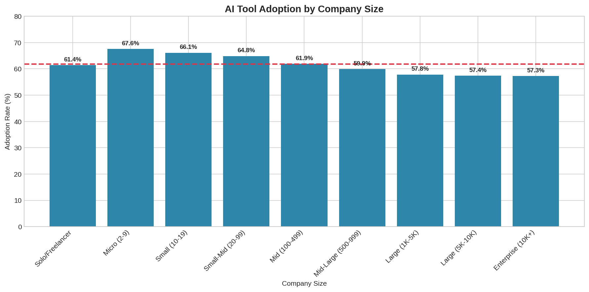
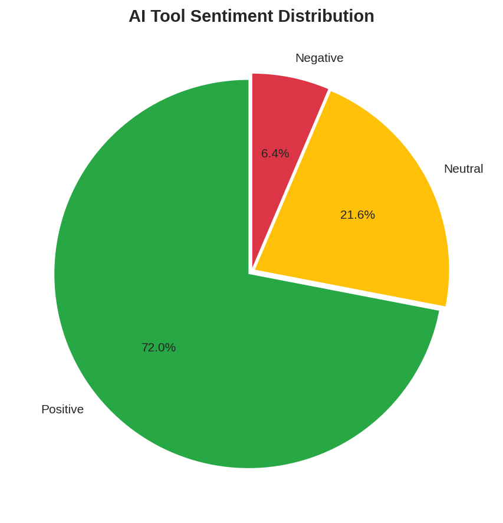
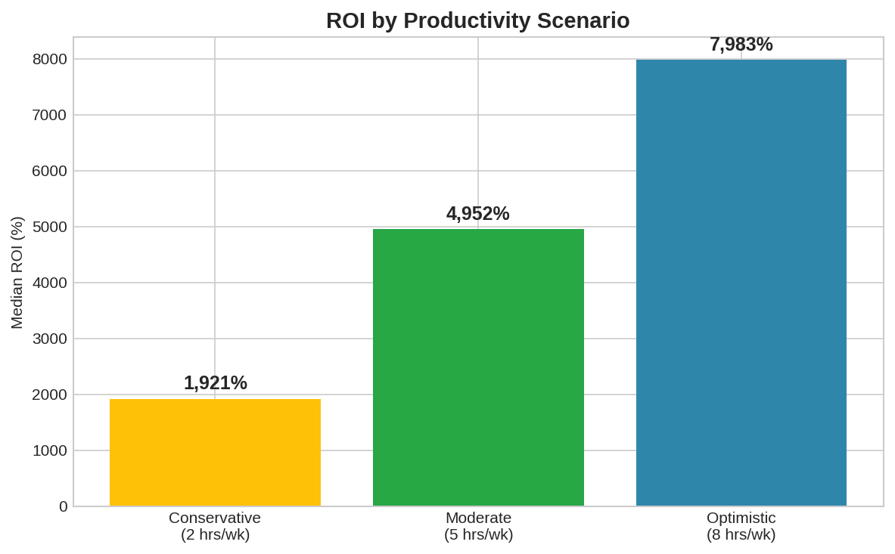

# 🤖 GenAI ROI Analysis: Measuring the Business Value of AI Coding Tools

[](https://www.python.org/downloads/)
[](https://pandas.pydata.org/)
[](LICENSE)

## 📋 Project Overview

This project analyzes the **Return on Investment (ROI)** of Generative AI coding tools (like GitHub Copilot, ChatGPT, etc.) using data from the **Stack Overflow Developer Survey 2024** with 60,000+ developer responses.

### 🎯 Business Questions Answered

1. **What is the current adoption rate of AI coding tools?**
2. **Which company sizes and roles benefit most from AI tools?**
3. **What ROI can companies expect from AI tool investments?**
4. **What are the main barriers to AI adoption?**
5. **How does AI perception vary across industries and regions?**

---

## 📊 Key Findings

### AI Adoption Overview
| Metric | Value |
|--------|-------|
| **Overall Adoption Rate** | 61.8% |
| **Planning to Adopt** | 13.8% |
| **Total Positive Sentiment** | 72% |

### ROI Analysis (Mid Scenario: 5 hrs/week saved)
| Company Size | Median ROI |
|--------------|------------|
| Small (2-99 employees) | ~5,200% |
| Mid-size (100-999) | ~4,800% |
| Enterprise (1000+) | ~4,500% |

### Top Challenges
1. **Trust Issues** - 53.9% of users
2. **Lacks Codebase Context** - 51.6% of users
3. **Security Concerns** - 25.6% of users

---

## 🗂️ Project Structure

```
genai-roi-analysis/
│
├── 📁 data/
│   ├── raw/                          # Original survey data
│   └── processed/                    # Cleaned datasets
│       ├── genai_roi_clean.csv      # Analysis-ready data
│       └── data_dictionary.csv      # Column definitions
│
├── 📁 notebooks/
│   ├── 01_data_exploration.ipynb    # Initial EDA
│   ├── 02_data_cleaning.ipynb       # Data preparation
│   └── 03_analysis_visualization.ipynb  # Final analysis
│
├── 📁 scripts/
│   ├── data_cleaning.py             # Cleaning functions
│   ├── analysis.py                  # Analysis functions
│   └── visualization.py             # Plotting functions
│
├── 📁 visualizations/
│   └── *.png                        # Generated charts
│
├── 📁 reports/
│   └── executive_summary.md         # Key findings
│
├── requirements.txt                  # Dependencies
├── README.md                        # This file
└── LICENSE                          # MIT License
```

---

## 🚀 Quick Start

### 1. Clone the Repository
```bash
git clone https://github.com/yourusername/genai-roi-analysis.git
cd genai-roi-analysis
```

### 2. Install Dependencies
```bash
pip install -r requirements.txt
```

### 3. Download Data
Download the Stack Overflow Developer Survey 2024 from:
https://survey.stackoverflow.co/

Place `survey_results_public.csv` in `data/raw/`

### 4. Run the Analysis
```bash
# Option 1: Run the complete pipeline
python scripts/main.py

# Option 2: Run notebooks interactively
jupyter notebook notebooks/
```

---

## 📈 Analysis Methodology

### Data Cleaning Pipeline
1. **Filter relevant columns** - 27 AI-related and demographic fields
2. **Create derived metrics** - Sentiment scores, trust scores, ROI calculations
3. **Handle missing values** - Strategic imputation and flagging
4. **Standardize categories** - Company size, roles, regions

### ROI Calculation Model
```
Annual Value = Hours Saved/Week × Hourly Rate × 50 weeks
Annual Cost = Tool Subscription × 12 months
ROI = ((Value - Cost) / Cost) × 100%
```

**Assumptions:**
| Scenario | Hours Saved/Week | Tool Cost/Year |
|----------|------------------|----------------|
| Conservative | 2 hours | $240 |
| Moderate | 5 hours | $240 |
| Optimistic | 8 hours | $240 |

---

## 📊 Visualizations

### AI Adoption by Company Size


### Sentiment Distribution


### ROI Scenarios


---

## 🛠️ Tech Stack

- **Python 3.8+** - Core programming
- **Pandas** - Data manipulation
- **NumPy** - Numerical operations
- **Matplotlib/Seaborn** - Visualizations
- **Plotly** - Interactive charts
- **Jupyter** - Notebook environment

---

## 📝 Data Dictionary

Key columns in the cleaned dataset:

| Column | Description | Type |
|--------|-------------|------|
| `AI_Status` | Using AI / Planning / Not Using | Categorical |
| `Sentiment_Score` | AI sentiment (1-5 scale) | Numeric |
| `Trust_Score` | Trust in AI output (1-5) | Numeric |
| `ROI_Mid` | Calculated ROI (mid scenario) | Numeric |
| `Company_Size_Category` | Standardized company size | Categorical |
| `Role_Category` | Simplified job roles | Categorical |
| `Region` | Geographic region | Categorical |

See `data/processed/data_dictionary.csv` for complete documentation.

---

## 🎯 Business Recommendations

Based on the analysis:

1. **For Small Companies (2-99 employees)**
   - Highest adoption potential (67.6% already using)
   - Focus on productivity benefits messaging
   - ROI payback period: < 1 month

2. **For Enterprises (1000+ employees)**
   - Address security and policy concerns first
   - Pilot programs with Data Science/ML teams
   - Invest in training programs

3. **For Tool Vendors**
   - Improve codebase context understanding
   - Build trust through transparency
   - Target front-end and full-stack developers

---

## 📧 Contact

**Your Name**
- LinkedIn: [Your LinkedIn](https://linkedin.com/in/kanishtyagi123)
- GitHub: [Your GitHub](https://github.com/kanish5)
- Portfolio: [Your Portfolio](https://kanish5.github.io/kanish-portfolio/)

---

## 📄 License

This project is licensed under the MIT License - see the [LICENSE](LICENSE) file for details.

---

## 🙏 Acknowledgments

- [Stack Overflow](https://stackoverflow.com/) for the Developer Survey data
- The open-source Python community

---

*Last Updated: March 2025*
